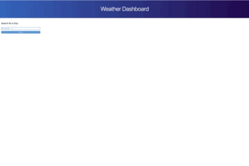
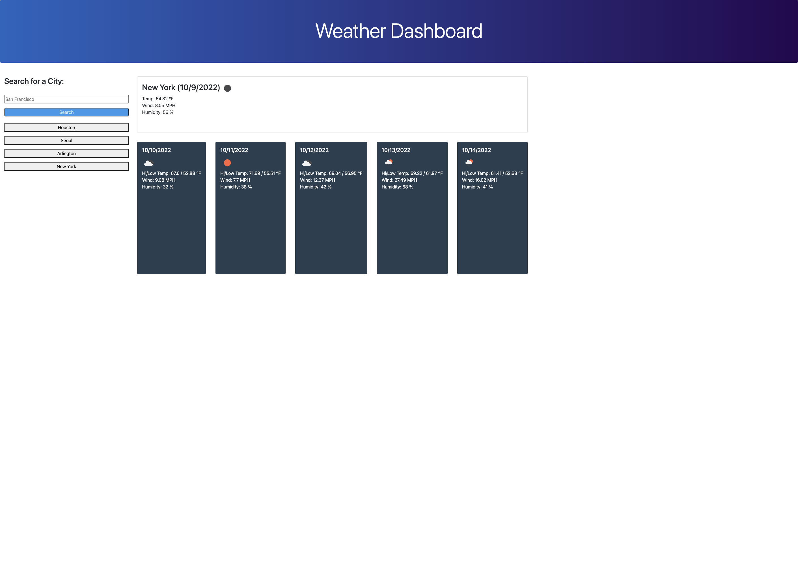

# Weather Forecast App



## Technologies
This project uses [Bootstrap](https://getbootstrap.com/) for the frontend toolkit and [jQuery](https://jquery.com/) for manipulating the HTML document. It also uses three APIs from OpenWeather, the [Geocoding API](https://openweathermap.org/api/geocoding-api), the [One Call API](https://openweathermap.org/api/one-call-3) and [Current Weather Data API](https://openweathermap.org/current) throughout the app.

## Purpose
This project introduces uses of third-party APIs and reinforces use of jQuery and Bootstrap as well as use of localStorage.

## Description
The app allows a user to type in a city name and get its current weather and 5 day forecast (within imperial units e.g. MPH, Fahrenheit). This also saves the search below the text entry which persists even if the user refreshes the page.

## Architecture
The majority of the app uses jQuery to dynamically inject elements into the page as needed; however to get the data needed for the weather to be displayed, three APIs are used. First a fetch is made on the Geocoding API based on a city name search within getLatLonCoordinates function. From this, an latitude, longitude pair of coordinates are returned and then chained into getWeather function. getWeather has lots of logic involved which will be explained later but for now, it handles the One Call API and Current Weather Data API, both of which require latitude and longitude coordinates, hence the first Geocoding API call. With the latter two API calls, data is then stored within localStorage as weatherData and then populateCurrentWeatherCardContent, populateForecastWeatherCardContent, and appendCitySearchButton functions each respectively fill their content section with dynamic information (appendCitySearchButton however is set as an immediately invoked function expression to load in any saved searches when the user revisits the page).

At a more detailed look of getWeather function with its logic explained in detail:
  - The function getWeather itself uses async and await to yield the results of getLatLonCoordinates. Since the other two API calls requires lat, long coordinates it's necessary to have the results ready. 

```
var weatherData = JSON.parse(localStorage.getItem("weatherData")) || {}
  if (Object.keys(weatherData).length === 0 || weatherData[cityName] === undefined) {
    weatherData[cityName] = {
      forecast: {},
      currentWeather: {}
    }
  } 

  if (weatherData[cityName].currentWeather.header && weatherData[cityName].currentWeather.header.includes(currentDate)) {
    populateCurrentWeatherCardContent(cityName)
    populateForecastWeatherCardContent(cityName)
    return;
  }
```
  - The code snippet above checks whether weatherData within localStorage already exists or to make it into an object. Next, via the currentWeather.header and if it includes the currentDate, the app can know if there is any need to refetch data or if the data already stored has the currentDate; if not then there is outdated information that would require fetching of the newer date data. If the currentDate matches, then the weather cards are populated with information already within localStorage and a return is used to exit out of the function before getting to make the new fetch API calls.
  - A for loop starting from 1 - 5 is called within the .then of the Open Call API. 1st index and onwards coorespond to tomorrow's weather and onward. 
  - After the last fetch call within getWeather function, a button is appended to the savedSearchContainer to account for new entries that were not accounted for at first load of grabbing saved search results.

## Screenshot


## Livesite
[Deployed on Github page](https://richardjhong.github.io/weather-forecast/)

## Thoughts on improvement
I tried to include logic to mitigate having to make API call requests unnecessarily within getWeather; however the getLatLonCoordinates helper method within is still called before the possible return statement. While I tried to move the getLatLonCoordinates to after the return statement, this shifted logic and moving parts to the point that the saved search button results had unexpected behavior with different interactions. I'd look into seeing how to improve this such that API calls requests are only made when needed reactively rather than proactively. Another possible improvement would be to make saved searches that cooincide with the current displayed city weather to be removed or visibly marked to indicate to the user that the search is redundant. 


